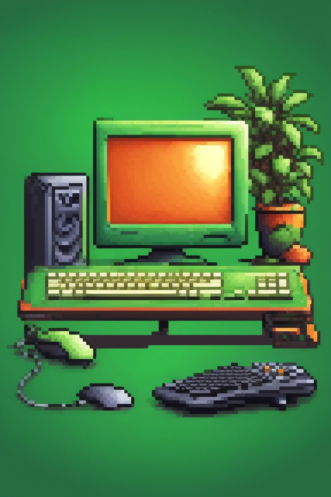
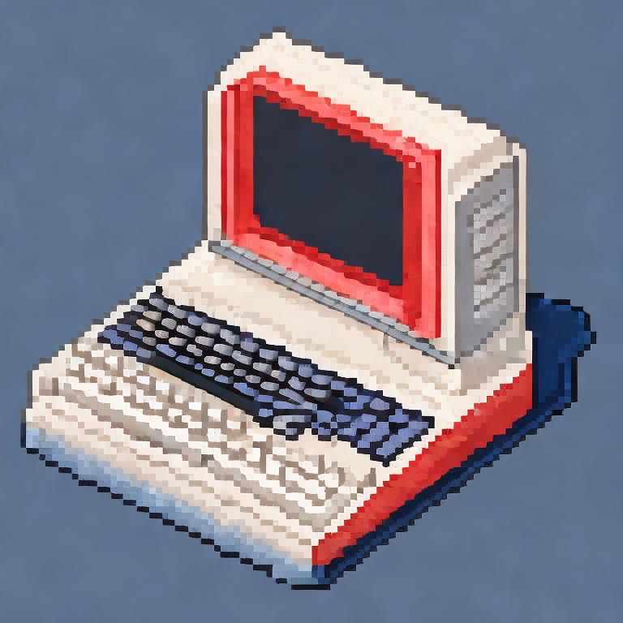

# portifolio
 Portifólio pessoal programação
# Colors 
 Background header: 5D94FB 
# fonts 
 Title:
 Text:

#  main 
 <!--> <main>
        

            <h2 class="child-h1"> Sobre Mim</h2>
            
Apaixonado por criar soluções inovadoras e funcionais. Estou iniciando minha jornada como programador, focado em aprender e dominar diversas tecnologias, como desenvolvimento web, mobile e data science. Busco constantemente projetos desafiadores para aprimorar minhas habilidades e adquirir experiência prática. Estou aberto a oportunidades de estágio, colaborações ou projetos freelancers, pois acredito que a prática é essencial para meu crescimento profissional. Vamos construir o futuro juntos através da tecnologia!

        

        

            
            
        

    </main>
<!-->
# style css
    main{
        background-color: rgb(36, 33, 33);
    }
    .img-coputador-greem, .img-computador-blue{
        width: 100px;
    }
    main.child-h1{
        font-size:10px;
    }
    main.child-paragrafo{
        font-size:10px;
    }
 